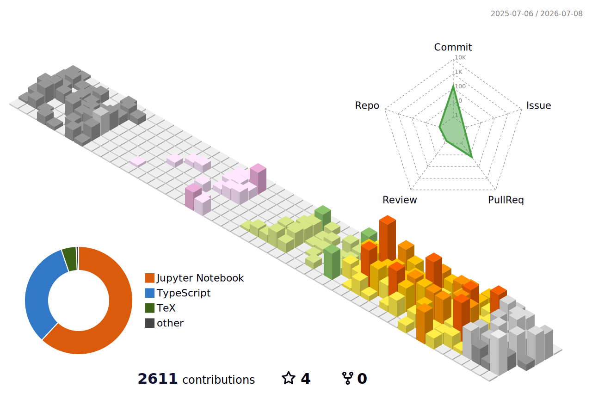

<!-- ░░ HEADER ░░ -->

### `Creative engineer building tools for complexity, democracy & curiosity.`

 

<!-- ░░ CONTACT ░░ -->

 

---

## `whoami`

🎓 &nbsp;**MSc in Computer Science** & Civil Industrial Engineer — *Pontifical Catholic University of Chile (PUC)*.

🧠 &nbsp;I specialized in **Natural Language Processing** powered by **machine learning** — bias detection, hate-speech moderation, and privacy-aware modeling. Research at the **National Center for AI of Chile (CENIA)** and **Inria** (Magnet team), with work published at **ACL 2025**.

🚀 &nbsp;Today I bring that research rigor into a **hands-on technical role at a startup**, building AI-agent workflows and data pipelines that turn customer pain points into product — and moved lead-to-subscriber conversion from **2% → 12% in under two months**.

🇨🇱 &nbsp;Based in Santiago, Chile · comfortable at the intersection of **data, product, and business**.

---

## `tech stack`

**AI & Machine Learning**

**Languages & Web**

**Data & Visualization**

**Workflow & Tools**

---

## `featured`

| | |
|---|---|
| 🌐 **Portfolio** — work, play & writing | <https://martinborquez.com> |
| 📄 **ACL 2025 (WOAH)** — *Hate Explained: Evaluating NER-Enriched Text in Human and Machine Moderation of Hate Speech* | [aclanthology.org](https://aclanthology.org/2025.woah-1.42.pdf) |
| 📄 **arXiv 2024** — *Recipient Profiling: Predicting Characteristics from Messages* | [arxiv.org/abs/2412.12954](https://arxiv.org/abs/2412.12954) |
| 🎙️ **0ratoria** — AI app to improve public speaking *(Platanus Hackathon)* | [0ratoria.vercel.app](https://0ratoria.vercel.app/) |

---

## `github stats`

### 3D contribution skyline

<!-- ░░ Generated by .github/workflows/profile-3d.yml — south-season = Southern Hemisphere 🇨🇱 ░░ -->

<!-- ░░ SNAKE — generated by .github/workflows/snake.yml into the `output` branch ░░ -->

<picture>
  <source media="(prefers-color-scheme: dark)" srcset="https://raw.githubusercontent.com/borquezmartin/borquezmartin/output/github-snake-dark.svg" />
  <source media="(prefers-color-scheme: light)" srcset="https://raw.githubusercontent.com/borquezmartin/borquezmartin/output/github-snake.svg" />
  
</picture>

---

`Let's build something legible.` — find me at <a href="https://martinborquez.com">martinborquez.com</a>

